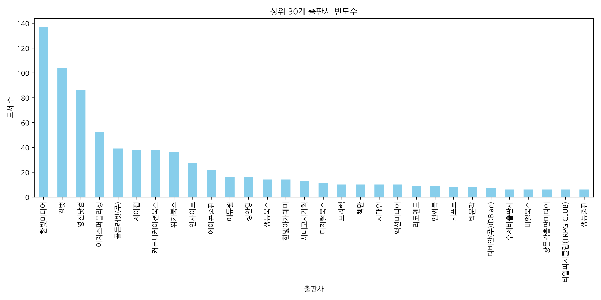
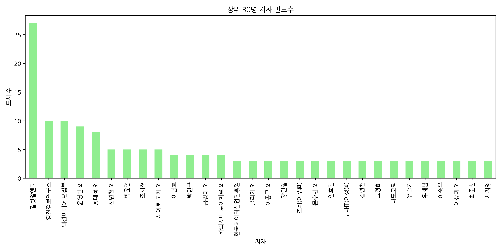
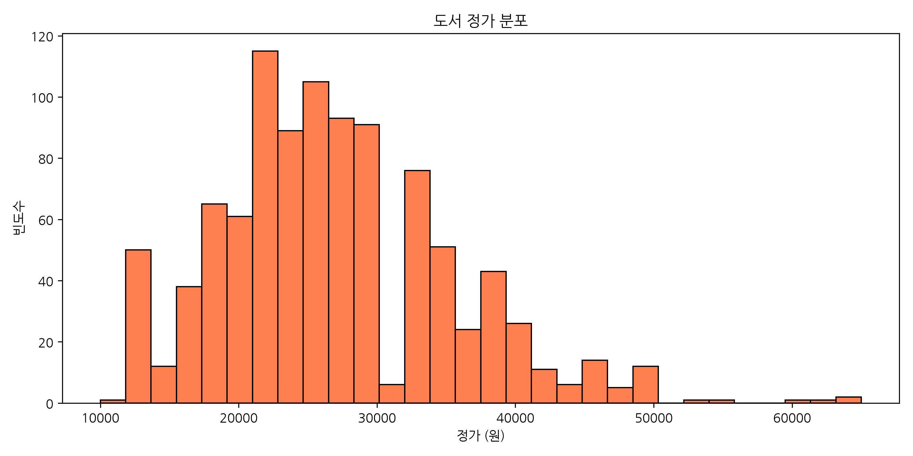
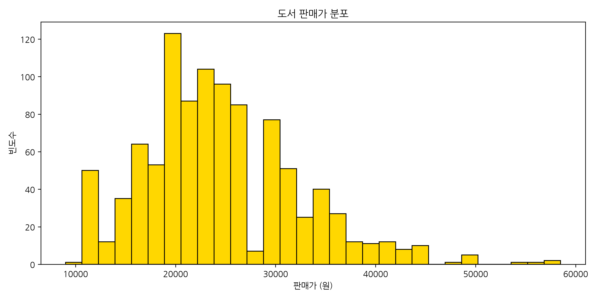
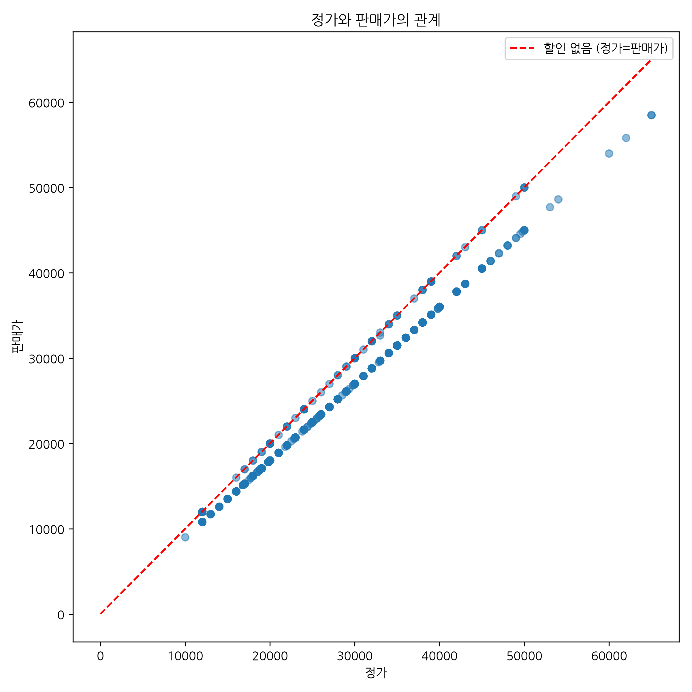
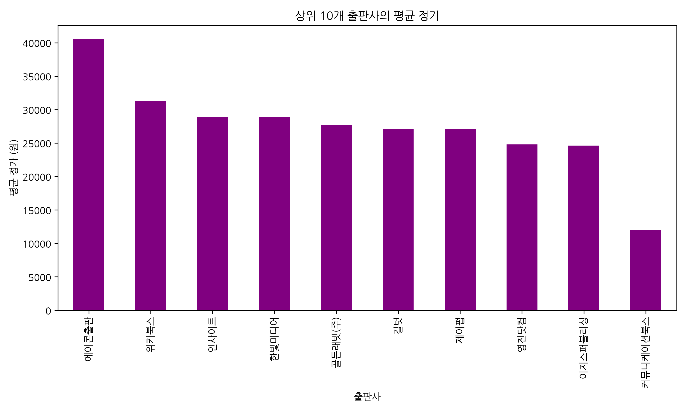
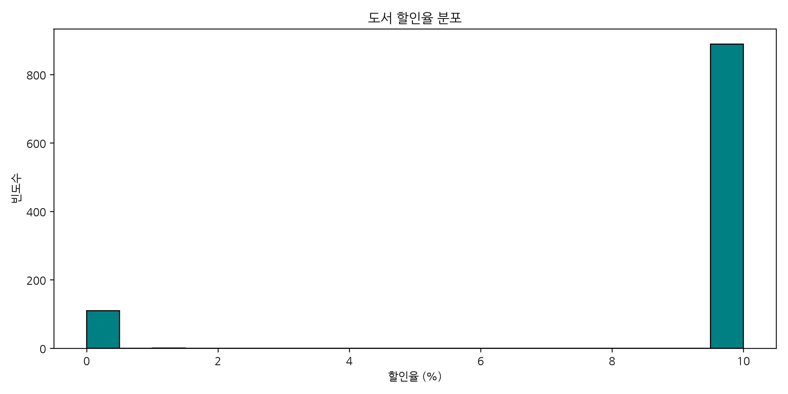
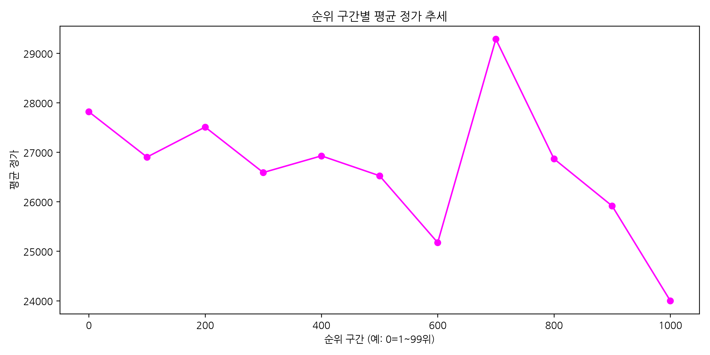
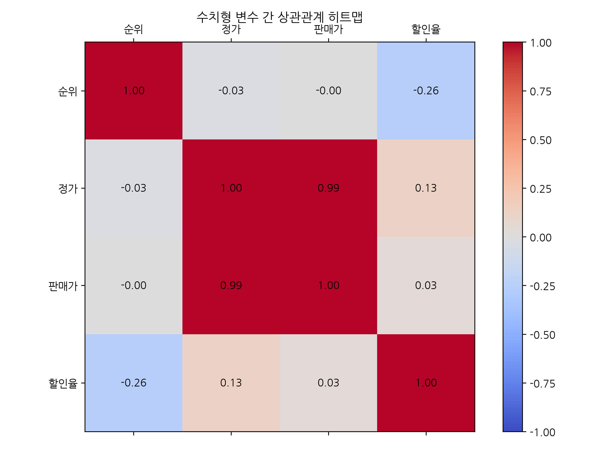
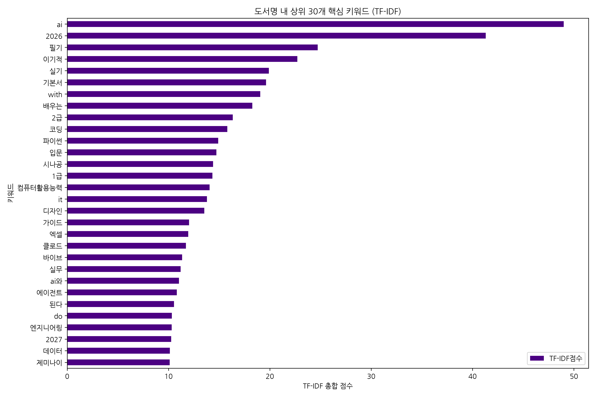

# 교보문고 베스트셀러 탐색적 데이터 분석(EDA) 리포트
## 1. 데이터 기본 탐색
### 상위 5개 행
```text
   순위                                 도서명           저자         출판사     정가    판매가   할인율
0   1           2026 이지패스 ADsP 데이터분석 준전문가        박현민 외        위키북스  30000  27000  10.0
1   2                       SQL 자격검정 실전문제   한국데이터산업진흥원  한국데이터산업진흥원  18000  18000   0.0
2   3      2026 한 권으로 끝내는 시나공 컴활 2급 필기+실기        길벗알앤디          길벗  27000  24300  10.0
3   4  바로바로 클로드 with 코워크, 스킬, 클로드 코드, 디자인          차진우     골든래빗(주)  28000  25200  10.0
4   5       챗GPT · 제미나이 · 클로드까지 모두를 위한 AI  지현이(디지털거북이)         시프트  22000  19800  10.0
```
### 하위 5개 행
```text
       순위                             도서명        저자     출판사     정가    판매가   할인율
995   996                      이것도 AI가 만듦     한선옥 외     파지트  19000  17100  10.0
996   997              플레이어를 사로잡는 게임의 심리학       규리네   루비페이퍼  22000  19800  10.0
997   998        코딩으로 피어나는 스마트팜 with 인공지능     표정완 외    종합서적  22000  19800  10.0
998   999  2026 이패스 AI능력시험 AICE Associate     신성진 외  이패스코리아  35000  31500  10.0
999  1000                   오토사 기본 개념과 응용  호삼 소파르 외    지니북스  24000  24000   0.0
```
### 데이터 기본 정보 (info)
```text
<class 'pandas.DataFrame'>
RangeIndex: 1000 entries, 0 to 999
Data columns (total 7 columns):
 #   Column  Non-Null Count  Dtype  
---  ------  --------------  -----  
 0   순위      1000 non-null   int64  
 1   도서명     1000 non-null   str    
 2   저자      1000 non-null   str    
 3   출판사     1000 non-null   str    
 4   정가      1000 non-null   int64  
 5   판매가     1000 non-null   int64  
 6   할인율     1000 non-null   float64
dtypes: float64(1), int64(3), str(3)
memory usage: 54.8 KB

```
### 데이터 크기
- **전체 행(Row) 수**: 1000
- **전체 열(Column) 수**: 7

### 중복 데이터 확인
- **중복된 행의 수**: 0

### 수치형 변수 기술통계량
```text
                순위            정가           판매가         할인율
count  1000.000000   1000.000000   1000.000000  1000.00000
mean    500.500000  26947.500000  24517.120000     8.89100
std     288.819436   8433.207737   7704.805652     3.14022
min       1.000000  10000.000000   9000.000000     0.00000
25%     250.750000  22000.000000  19800.000000    10.00000
50%     500.500000  26000.000000  23400.000000    10.00000
75%     750.250000  32000.000000  28800.000000    10.00000
max    1000.000000  65000.000000  58500.000000    10.00000
```
### 범주형 변수 기술통계량
```text
                             도서명     저자    출판사
count                       1000   1000   1000
unique                       996    790    162
top     2027 이기적 ITQ 한글 ver.2022  길벗알앤디  한빛미디어
freq                           2     27    137
```
## 2. 데이터 시각화 및 심층 분석
### 1. 상위 30개 출판사 빈도수


**[참고 표/통계량]**
```text
                   count
출판사                     
한빛미디어                137
길벗                   104
영진닷컴                  86
이지스퍼블리싱               52
골든래빗(주)               39
제이펍                   38
커뮤니케이션북스              38
위키북스                  36
인사이트                  27
에이콘출판                 22
에듀윌                   16
성안당                   16
생능북스                  14
한빛아카데미                14
시대고시기획                13
디지털북스                 11
프리렉                   10
책만                    10
시대인                   10
액션미디어                 10
리코멘드                   9
앤써북                    9
시프트                    8
박문각                    8
디비안(주)(DBian)          7
수제비출판사                 6
비엘북스                   6
광문각출판미디어               6
티알피지클럽(TRPG CLUB)      6
생능출판                   6
```

**[해석 및 인사이트]**
가장 많은 베스트셀러를 배출한 출판사를 확인하기 위한 시각화입니다. 특정 출판사가 상위권을 독점하고 있는지, 아니면 다양한 출판사가 골고루 분포하고 있는지 확인할 수 있습니다. 데이터 분석 결과 상위 출판사들의 점유율이 두드러지게 나타나는 것을 알 수 있으며, 이는 IT/컴퓨터 분야에서 특정 출판사들의 브랜드 파워나 기획력이 시장에서 강하게 작용함을 시사합니다.

### 2. 상위 30명 저자 빈도수


**[참고 표/통계량]**
```text
             count
저자                
길벗알앤디           27
영진정보연구소         10
액션미디어 편집부       10
윤영빈 외            9
홍태성 외            8
신면철 외            5
박윤정              5
조시형              5
사이토 고키 외         5
이남호              4
박현규              4
공경태 외            4
카와시마 토이치로 외      4
한국데이터산업진흥원       3
클리커 외            3
이종구 외            3
강민철              3
조쉬(이주환)          3
문수민 외            3
임호진              3
누나IT(이성원)        3
김영철              3
고경희              3
나도코딩             3
유슬기              3
우재남              3
이승우              3
이상미 외            3
최준선              3
서지영              3
```

**[해석 및 인사이트]**
베스트셀러 목록에 가장 많이 이름을 올린 저자 상위 30명을 시각화한 결과입니다. 단일 저자가 여러 책을 흥행시켰는지, 다양한 저자들이 경쟁하고 있는지 보여줍니다. 주로 수험서나 기본서를 지속적으로 출간하는 특정 저자 혹은 단체(팀)가 다수의 도서를 베스트셀러에 올리는 경향을 뚜렷하게 확인할 수 있습니다.

### 3. 도서 정가 분포


**[참고 표/통계량]**
```text
                 정가
count   1000.000000
mean   26947.500000
std     8433.207737
min    10000.000000
25%    22000.000000
50%    26000.000000
75%    32000.000000
max    65000.000000
```

**[해석 및 인사이트]**
도서들의 정가가 어떤 가격대에 집중되어 있는지 파악하기 위한 히스토그램입니다. 대부분의 IT/컴퓨터 도서들이 특정 가격대(예: 2~3만원대)에 밀집해 있는 것을 볼 수 있습니다. 이는 전공 서적이나 실무서의 평균적인 가격 저항선과 시장의 표준 가격대가 형성되어 있음을 의미하며 출판사의 가격 책정 전략을 엿볼 수 있습니다.

### 4. 도서 판매가 분포


**[참고 표/통계량]**
```text
                판매가
count   1000.000000
mean   24517.120000
std     7704.805652
min     9000.000000
25%    19800.000000
50%    23400.000000
75%    28800.000000
max    58500.000000
```

**[해석 및 인사이트]**
실제 소비자가 구매하는 판매가의 분포를 시각화한 히스토그램입니다. 정가 분포와 유사한 형태를 띠지만, 온라인 서점의 기본 할인율(주로 10%)이 적용되어 전체적으로 가격대가 낮아진 축으로 이동한 모습을 명확하게 확인할 수 있습니다. 실질적인 구매자들의 예산 범위를 파악하는데 중요한 자료가 됩니다.

### 5. 정가와 판매가의 상관관계 산점도


**[참고 표/통계량]**
```text
          정가      판매가
정가   1.00000  0.99412
판매가  0.99412  1.00000
```

**[해석 및 인사이트]**
정가와 판매가 사이의 관계를 나타내는 산점도(Scatter plot)입니다. 붉은 점선은 할인이 전혀 없는 상태를 의미하며, 대부분의 점들이 이 선보다 약간 아래에 일직선 형태로 위치하고 있습니다. 이는 대부분의 도서가 일괄적으로 10% 할인을 적용받고 있는 도서 정가제의 전형적인 패턴을 그대로 반영하고 있음을 확실하게 보여줍니다.

### 6. 상위 10개 출판사의 평균 정가


**[참고 표/통계량]**
```text
                    정가
출판사                   
에이콘출판     40590.909091
위키북스      31333.333333
인사이트      28925.925926
한빛미디어     28852.554745
골든래빗(주)   27723.076923
길벗        27090.384615
제이펍       27086.842105
영진닷컴      24779.069767
이지스퍼블리싱   24632.692308
커뮤니케이션북스  12000.000000
```

**[해석 및 인사이트]**
가장 많은 베스트셀러를 배출한 상위 10개 출판사들을 대상으로 평균 정가를 비교한 바 차트입니다. 출판사별로 주로 다루는 도서의 성격(가벼운 입문서 vs 두꺼운 전문 개발서)에 따라 평균 가격대가 눈에 띄게 다름을 알 수 있습니다. 특정 출판사가 고가의 전문서적 위주로 포지셔닝하고 있는지, 저렴한 대중서 위주인지 파악할 수 있는 유용한 지표입니다.

### 7. 도서 할인율 분포


**[참고 표/통계량]**
```text
              할인율
count  1000.00000
mean      8.89100
std       3.14022
min       0.00000
25%      10.00000
50%      10.00000
75%      10.00000
max      10.00000
```

**[해석 및 인사이트]**
도서별 할인율((정가-판매가)/정가)의 분포를 나타냅니다. 대부분의 도서가 정확히 10%의 할인율 구간에 압도적으로 집중되어 있는 것을 확인할 수 있습니다. 한국의 현행 도서정가제 하에서 온라인 서점이 제공할 수 있는 최대 직간접 할인이 적용된 결과이며, 가격 경쟁보다는 콘텐츠 자체의 경쟁력이 중요함을 반증합니다.

### 8. 순위 구간별 평균 정가 추세


**[참고 표/통계량]**
```text
                정가
순위구간              
0     27818.181818
100   26902.000000
200   27509.000000
300   26590.000000
400   26927.000000
500   26525.000000
600   25174.000000
700   29286.000000
800   26867.000000
900   25915.000000
1000  24000.000000
```

**[해석 및 인사이트]**
순위 구간별(100위 단위)로 평균 정가가 어떻게 변화하는지 보여주는 선 그래프입니다. 최상위권 베스트셀러들이 상대적으로 가격이 낮은 대중적인 입문서인지, 아니면 가격이 높더라도 필수적인 수험서/전문서적인지 그 특징을 파악할 수 있습니다. 전반적인 가격 변동 추세를 통해 독자들의 구매 심리나 선호 가격대를 유추할 수 있는 의미 있는 시각화입니다.

### 9. 수치형 변수 간 상관관계 히트맵


**[참고 표/통계량]**
```text
           순위        정가       판매가       할인율
순위   1.000000 -0.027051 -0.004575 -0.259454
정가  -0.027051  1.000000  0.994120  0.130323
판매가 -0.004575  0.994120  1.000000  0.031255
할인율 -0.259454  0.130323  0.031255  1.000000
```

**[해석 및 인사이트]**
순위, 정가, 판매가, 할인율 등 수치형 변수들 간의 상관관계를 한눈에 파악할 수 있는 히트맵 시각화입니다. 정가와 판매가는 당연히 1.0에 가까운 극도로 높은 양의 상관관계를 보입니다. 반면 순위와 가격 변수들 간의 상관계수는 0에 가깝게 나타나, 단순히 가격이 저렴하다고 해서 순위가 높아지거나 비싸다고 순위가 낮아지는 단순 선형 관계는 아님을 분명히 보여줍니다.

## 3. 텍스트 데이터 분석 (도서명 TF-IDF)
### 10. 도서명 내 상위 30개 핵심 키워드 (TF-IDF)


**[참고 표/통계량]**
```text
    키워드  TF-IDF점수
     ai 48.997929
   2026 41.298688
     필기 24.720826
    이기적 22.718455
     실기 19.906232
    기본서 19.629830
   with 19.056077
    배우는 18.276518
     2급 16.340513
     코딩 15.797269
    파이썬 14.913181
     입문 14.727408
    시나공 14.404456
     1급 14.341283
컴퓨터활용능력 14.059287
     it 13.787851
    디자인 13.541556
    가이드 12.026615
     엑셀 11.947425
    클로드 11.717625
    바이브 11.341387
     실무 11.199336
    ai와 11.038144
   에이전트 10.826210
     된다 10.541090
     do 10.329101
  엔지니어링 10.308905
   2027 10.264175
    데이터 10.137701
   제미나이 10.118707
```

**[해석 및 인사이트]**
도서명 텍스트 데이터를 대상으로 TF-IDF 알고리즘을 적용하여 추출한 핵심 키워드 상위 30개의 중요도를 보여주는 가로 막대 그래프입니다. 단순 빈도수가 아니라 단어의 정보량을 고려한 기법을 적용했기 때문에, 현재 IT/컴퓨터 도서 시장에서 가장 뜨거운 트렌드(예: 파이썬, AI, 자격증 이름 등)가 무엇인지 정확하게 짚어냅니다. 독자들이 가장 갈구하는 기술 스택과 학습 주제를 직관적으로 확인할 수 있습니다.

