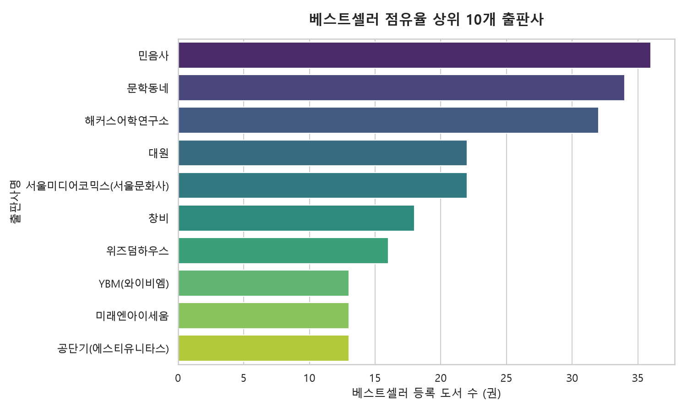
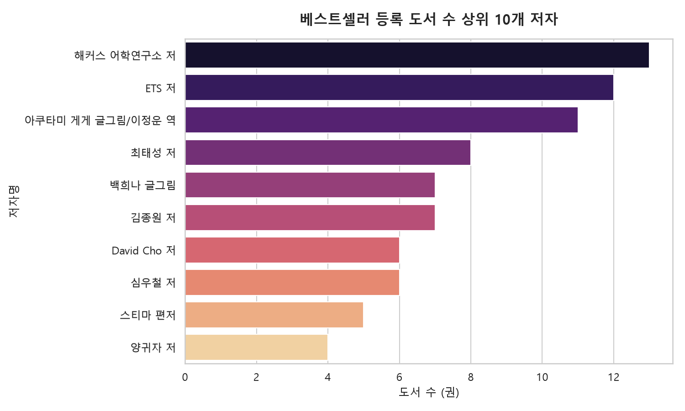
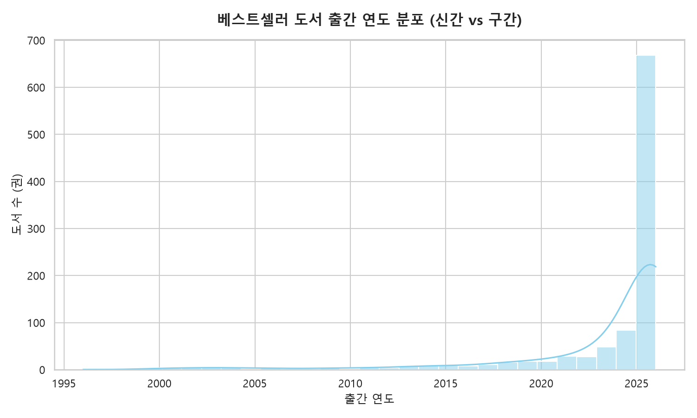
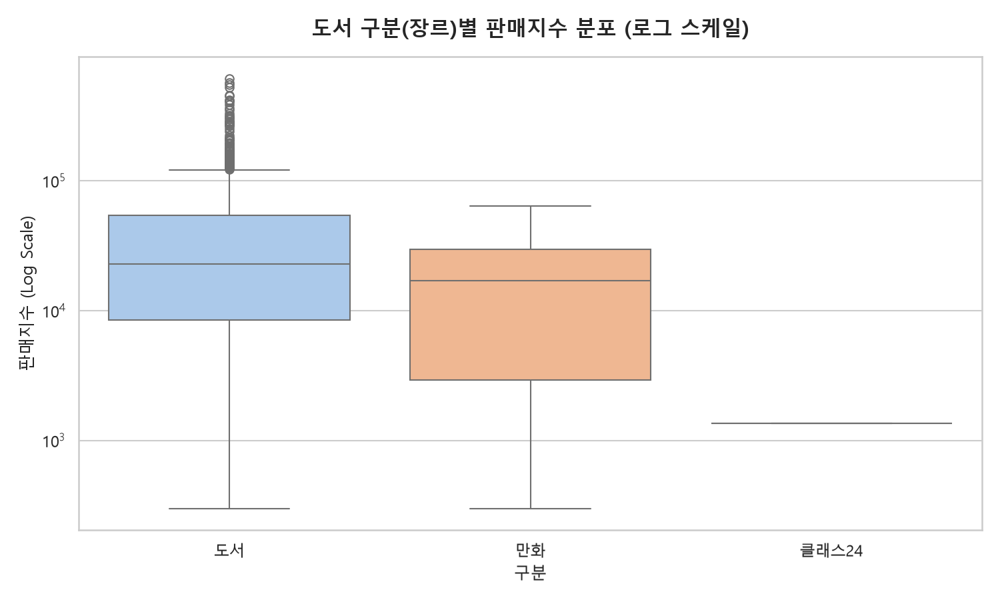
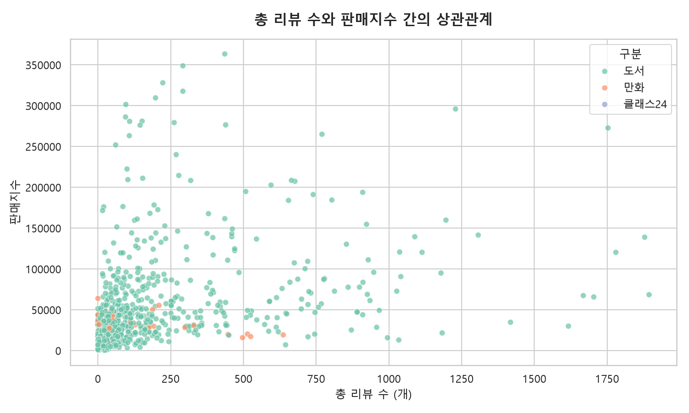

<!-- 슬라이드 1 -->
<!-- _class: interstitial -->
# YES24 당일 베스트셀러 데이터 분석(EDA) 보고서

심층 분석 및 시각화 리포트

---

<!-- 슬라이드 2 -->
# 📋 목차 (Index)

1. **데이터 수집 및 분석 개요**
2. **데이터 요약 통계**
3. **세부 분석: 출판사 및 저자 분포**
4. **세부 분석: 출간 연도 및 장르**
5. **세부 분석: 리뷰와 판매지수의 상관관계**
6. **종합 결론 및 향후 시사점**

---

<!-- 슬라이드 3 -->
<!-- _class: interstitial -->
<h1>1. 데이터 수집 및 분석 개요</h1>

분석 배경 및 주요 지표 설명

---

<!-- 슬라이드 4 -->
# 📌 분석 배경 및 목적

- **분석 배경**
  - 도서 시장의 급격한 트렌드 변화 추적 필요성 대두
  - 베스트셀러 차트 진입의 핵심 요인 파악 요구 증가
- **분석 목적**
  - 베스트셀러 진입 도서들의 공통적 특징(가격, 리뷰, 장르) 도출
  - 시각화 데이터를 통한 출판 기획 및 마케팅 전략 수립의 근거 마련

---

<!-- 슬라이드 5 -->
# 📊 데이터 수집 기준

- **수집 대상 플랫폼**: YES24 (국내 최대 온라인 서점)
- **수집 기준 일자**: 당일 베스트셀러 차트 기준
- **수집 표본 크기**: 총 1,000건의 베스트셀러 도서 데이터
- **수집 항목**: 
  - 도서명, 저자, 출판사
  - 정가, 판매가, 판매지수, 평점, 리뷰 수 등

---

<!-- 슬라이드 6 -->
# 📖 주요 분석 지표 설명

- **판매지수 (Sales Index)**
  - 단순 판매량이 아닌 플랫폼 자체 알고리즘에 의해 산출된 도서 흥행 척도
  - 최근 판매 추이와 누적 판매량이 복합적으로 반영됨
- **리뷰 평점 및 리뷰 수**
  - 10점 만점 기준으로 환산된 독자 평점
  - 한줄평과 상세 리뷰를 모두 포괄하는 자발적 피드백 수치

---

<!-- 슬라이드 7 -->
<!-- _class: interstitial -->
<h1>2. 데이터 요약 통계</h1>

1,000건의 표본에 대한 기초 통계량

---

<!-- 슬라이드 8 -->
# 📈 대상 도서 및 고유 값 통계

- **분석 대상 도서 수**: 1,000권
- **고유 출판사 수**: 393개
  - 상위권 차트가 소수 출판사에 의해 완전히 지배되지 않음을 시사
- **고유 저자 수**: 808명
  - 1,000권의 책이 808명의 각기 다른 저자들에 의해 쓰여짐
  - 소수의 다작 저자와 다수의 단행본 저자가 혼재

---

<!-- 슬라이드 9 -->
# 💰 정가 및 판매가 분석

- **평균 정가**: 19,092원
  - 최근 종이값 상승 및 물가 인상분이 반영된 단행본 평균 가격대 형성
- **평균 판매가**: 17,247원
  - 대부분의 도서가 온라인 서점의 기본 할인 혜택을 적용받고 있음

---

<!-- 슬라이드 10 -->
# 🏷️ 할인율 분포 현황

- **평균 할인율**: 9.8%
- **할인 정책 인사이트**
  - 도서정가제로 인해 최대 10% 할인이 적용되는 현행법 테두리 내에서 대부분 최대치의 할인을 제공 중
  - 가격 경쟁보다는 콘텐츠와 굿즈(마일리지) 중심의 마케팅이 주류

---

<!-- 슬라이드 11 -->
# ⭐ 리뷰 및 평점 개요

- **평균 리뷰 평점**: 9.62점 (10점 만점 기준)
- **평점 인사이트**
  - 베스트셀러에 진입한 도서들은 기본적으로 대중의 긍정적인 평가를 동반함
  - 9점대 후반의 높은 평점이 '베스트셀러 유지'를 위한 필수 조건으로 작용

---

<!-- 슬라이드 12 -->
# 📚 도서 구분(장르)별 분포

전체 1,000권 중 장르별 비중 요약:
- **일반 도서(단행본)**: 939권 (93.9%)
- **만화**: 60권 (6.0%)
- **클래스24 등 기타**: 1권 (0.1%)
- **인사이트**: 일반 텍스트 기반의 단행본이 차트를 압도하고 있으나, 특정 팬덤을 가진 만화 카테고리의 틈새 시장 방어도 견고함

---

<!-- 슬라이드 13 -->
# 🏆 주요 특징 도서: 판매지수 1위

- **도서명**: `박곰희 연금 부자 수업`
- **저자 / 출판사**: 박곰희 저 / 인플루엔셜
- **판매지수**: 611,865
- **특징**
  - 압도적인 수치로 당일 베스트셀러 최상단 차지
  - 재테크 및 경제 실용서에 대한 대중의 폭발적인 수요 반영

---

<!-- 슬라이드 14 -->
# 🏆 주요 특징 도서: 최고 평점

- **도서명**: `인비인`
- **저자**: 성해나 저
- **평점 및 리뷰 수**: 평점 10.0점 / 리뷰 합계 41.0개
- **특징**
  - 30개 이상의 유의미한 표본(리뷰)이 쌓였음에도 만점(10.0)을 유지
  - 열성 독자들의 강력한 추천이 평점을 견인하는 사례

---

<!-- 슬라이드 15 -->
<!-- _class: interstitial -->
<h1>3. 세부 분석 및 시각화</h1>

출판사 및 저자 분포 심층 분석

---

<!-- 슬라이드 16 -->
# 🏢 베스트셀러 상위 10개 출판사

▲ 베스트셀러 상위 출판사: 다수의 출판사가 고르게 점유

---

<!-- 슬라이드 17 -->
# 💡 출판사 점유율 인사이트

- **특정 출판사의 독점 부재**
  - 차트를 1~2개 출판사가 휩쓰는 독점 구조가 나타나지 않음
  - 393개의 다양한 출판사가 고르게 파이를 나누어 가짐
- **브랜드 파워와 유통력**
  - 상위 10개 출판사는 지속적으로 인기 베스트셀러를 발굴하고 유통할 수 있는 탄탄한 독자 충성도와 기획력을 갖춤

---

<!-- 슬라이드 18 -->
# ✍️ 상위 10개 다작/인기 저자

▲ 베스트셀러 등록 도서 수 상위 저자 분포

---

<!-- 슬라이드 19 -->
# 💡 저자 점유율 인사이트

- **다작 및 팬덤 저자의 상위권 점유**
  - 한 저자가 동시에 여러 도서를 랭킹에 올리는 현상 발생
- **주요 저자군 특징**
  - 자격증 및 역사 수험서 저자 (예: 최태성 강사)
  - 연속된 시리즈물을 출간하는 만화 작가들
  - 확고한 독자 팬덤을 구축한 소설가 및 경제 전문가

---

<!-- 슬라이드 20 -->
<!-- _class: interstitial -->
<h1>4. 출간 연도 및 장르별 분석</h1>

시간의 흐름과 도서 형태에 따른 트렌드

---

<!-- 슬라이드 21 -->
# 📅 출간 연도 분포 시각화

▲ 출간 연도별 분포 현황: 최근 신간 위주의 폭발적 집중 현상

---

<!-- 슬라이드 22 -->
# 💡 출간 연도 인사이트

- **신작 마케팅의 강세**
  - 그래프의 최고점은 2025년과 2026년에 집중됨
  - 최신 트렌드를 반영한 신간들이 차트 진입에 매우 유리한 환경
- **스테디셀러의 생존**
  - 2000년대 초반 혹은 그 이전에 출간된 명저(예: 코스모스, 싯다르타)들이 그래프의 긴 꼬리를 형성
  - 마케팅 위주의 신간과 클래식 도서가 공존하는 한국 시장의 독특한 특성

---

<!-- 슬라이드 23 -->
# 📚 도서 구분(장르)별 판매지수

▲ 장르별 분포 현황: 일반 단행본의 절대적 주류 형성

---

<!-- 슬라이드 24 -->
# 💡 장르별 판매지수 인사이트

- **단행본의 절대적 우위**
  - `[도서]`로 분류된 일반 단행본이 점유율과 수치적 분포 모두에서 절대적인 주류를 차지
- **명확한 타겟층의 차별화**
  - `[만화]` 등 타 구분의 도서들은 권당 단가가 낮거나 타겟층이 확고하여, 평균 판매지수 및 분포도에서 일반 단행본과는 명확하게 구분되는 군집을 형성함

---

<!-- 슬라이드 25 -->
<!-- _class: interstitial -->
<h1>5. 리뷰와 판매지수의 상관관계</h1>

독자의 피드백이 판매에 미치는 영향

---

<!-- 슬라이드 26 -->
# 💬 리뷰와 판매지수 산점도

▲ 리뷰와 판매지수 상관관계: 확연한 양(+)의 상관관계 도출

---

<!-- 슬라이드 27 -->
# 💡 리뷰-판매 상관관계 인사이트

- **강력한 양의 상관관계 도출**
  - 그래프에서 우상향하는 뚜렷한 패턴 확인 가능
  - 리뷰 수(종이책/eBook 리뷰 및 한줄평의 총합)가 많은 책일수록 기하급수적으로 높은 판매지수를 기록함
- **리뷰의 기능적 가치**
  - 리뷰는 구매자들의 단순 감상평을 넘어, 잠재 고객의 '구매 결정'을 이끌어내는 가장 중요한 신뢰 지표로 작용함

---

<!-- 슬라이드 28 -->
<!-- _class: interstitial -->
<h1>6. 종합 결론 및 시사점</h1>

분석 요약 및 향후 출판 전략 제언

---

<!-- 슬라이드 29 -->
# 🎯 결론 1 & 2

1. **신간 주도의 시장 흐름과 스테디셀러의 굳건함**
   - 베스트셀러 리스트는 최근 1년 이내 출간된 도서 중심으로 로테이션이 활발함
   - 반면 검증된 고전은 시장 유행과 무관하게 든든한 캐시카우 역할을 수행
2. **리뷰 인프라 확보의 절대적 중요성**
   - 판매지수와 독자 리뷰 활성도 간의 밀접한 상관성이 데이터로 입증됨
   - 신작 발간 시, 초기에 독자 반응을 폭발적으로 이끌어내는 이벤트가 베스트셀러 안착의 핵심 요건임

---

<!-- 슬라이드 30 -->
# 🎯 결론 3 및 향후 전략

3. **학습/수험서 및 검증된 인플루언서의 강세 현상**
   - 역사 수험서, 명확한 목적의 시리즈 만화, 유명 경제 유튜버 등의 도서가 상위 랭킹을 견고하게 차지
   - 이는 불황일수록 확실한 정보와 효용(학습, 투자)을 얻고자 하는 독자들의 '실용 중심 트렌드'를 고스란히 반영함

- **💡 향후 출판 전략 제언**
  - 타겟 독자의 '명확한 효용성(실용성)'을 자극하는 기획 강화
  - 출간 즉시 리뷰를 쌓을 수 있는 사전 서평단 및 초기 팬덤 마케팅 집중
